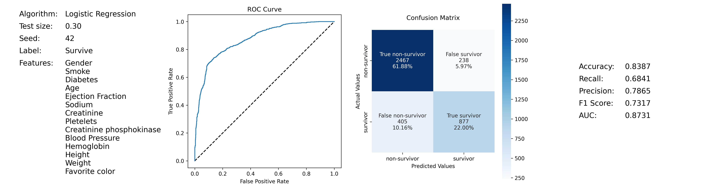

# Project: Predict survival of coronary artery disease patients for preemptive medical treatment

Name: Michael Ng  

## Folder structure  
- `data` folder
  - place `survive.db` here
- `output` folder
  - `sample` folder
- `src` folder
  - `config.ini`
  - `pipeline_Classifier.py`
  - `readConfig_loadData.py`
- `eda.ipynb`
- `README.md`
- `requirements.txt`
- `run.sh`

## Install

This project requires **Python 3** and the following packages installed:

- `configparser` == 5.2.0
- `pandas` == 1.3.5
- `numpy` == 1.22.0
- `matplotlib` == 3.5.1
- `sklearn` == 0.0
- `scikit-learn` == 1.0.2
- `seaborn` == 0.11.2

## Instructions
***
1. Open the `config.ini` file in your desired editor. It has these contents and further instructions on permissible values:
    ***
   [`DB`]  
   `DBNAME` = survive.db  
   `TABLENAME` = survive  
   [`PARAM`]  
   `ALGO` = 1  
   `TESTSIZE` = 0.30  
   `SEED` = 42  
   `FEATURES` = Gender,Smoke,Diabetes,Age,Ejection Fraction,Sodium,Creatinine,Pletelets,Creatinine phosphokinase,Blood Pressure,Hemoglobin,Height,Weight,Favorite color
    ***
    Brief description:  
    * `DBNAME` - [`string`] fullname of SQL database file to be placed in `data` folder  
    * `TABLENAME` - [`string`] name of table in database  
    * `ALGO` - [`integer`] classification algorithm  
    * `TESTSIZE` - [`float`] percentage of data to reserve as test set  
    * `SEED` - [`integer`] random state seed for train-test split  
    * `FEATURES` - [`string`] concatenated string of selected features for training the model on
    ***
2. At your shell terminal where you have activated your python environment, type `"sh run.sh"` and enter. Give it a full minute to complete.  
    ***
3. It will run the `run.py` python script in the `src` subfolder, which performs this series of instructions:

    a. Read `config.ini` and assign variables (with `readConfig_loadData.py` module)  
    b. Load SQL data  
    c. Load to dataframe  
    d. Clean data  
    e. Run pipeline* (with `pipeline_Classifier.py` module)  
    f. Save plot as JPG in `output` folder

***
## Sample JPG output

***
## * Pipeline flow
    1. Separate features and labels
    2. Split data into training set and test set
    3. Select algorithm
    4. Generate string list for Categorical Features from p_ls_features
    5. Generate string list for Numeric Features from the difference
    6. Generate a dynamic dictionary that updates the values when different sets of features are selected
    7. Generate integer list for Numeric Features (needed for scaling pre-processing)
    8. Generate integer list for Categorical Features (needed for one hot encoding pre-processing)
    9. Define preprocessing for numeric columns (make them on the same scale)
    10. Define preprocessing for categorical features (encode them)
    11. Combine preprocessing steps
    12. Create preprocessing and training pipeline
    13. Fit the pipeline to train a logistic regression model on the training set
    14. Get predictions from test data
    15. Calculate ROC curve
    16. Format plots arrangement
    17. Text display of selected Features shown in 1st subplot
    18. Print input parameters in 1st subplot
    19. Plot ROC curve in 2nd subplot
    20. Plot Confusion Matrix in 3rd subplot
    21. Print metrics in 4th subplot
***
## Key findings from the EDA
* We want a high **Recall** value as the cost of a false negative is high. We do not want to miss identifying a patient who truly needs preemptive medical attention (False Negative). Precision is less important as the costs of further tests is not disproportionately costly in risk, time or funds. Accuracy is not ideal too as the population of non-Survivors and Survivors is not symmetrical.
* The most impactful features on predictive ability are **'Ejection Fraction'**, **'Pletelets'**, **'Blood Pressure'**, and **'Hemoglobin'**.
* The **Random Forest Classifier** generates the best predictions, followed by K-Nearest Neighbour.
***
## Algorithms available for experimentation
* Classification
  * Logistic Regression
  * Random Forest Classifier
  * Support Vector Machine
  * K-Nearest Neighbour
***
## Metrics available  
* Accuracy
* Recall (use this)
* Precision
* F1 Score
* AUC (use this)
***
## Other considerations
* It would be useful to test the models on data from another hospital to minimise the impact on data entry/regime errors. 
***
## Updates
* `plot_distrbution` method in `eda.ipynb` renamed to `histo_boxplot` and shifted to `plotter` package, submodule `plot_distribution.py`
* in `__init__.py` of `plotter` package, import `histo_boxplot` to save typing submodule `plot_distribution`
* reformatted `histo_boxplot` method to be compliant with PEP8, using `pycodestyle` check
* added docstrings to `histo_boxplot` method
* converted `histo_boxplot` method into `Distribution` class in submodule `plot_distribution.py` (retained `histo_boxplot` method for reference) - benefits are that metrics can now be assess as instance objects of `Distribution` class
* added docstrings to `Distribution` class
